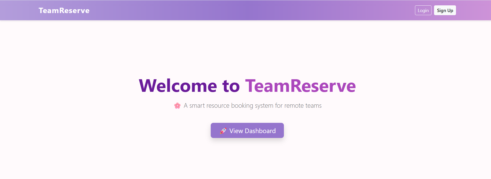
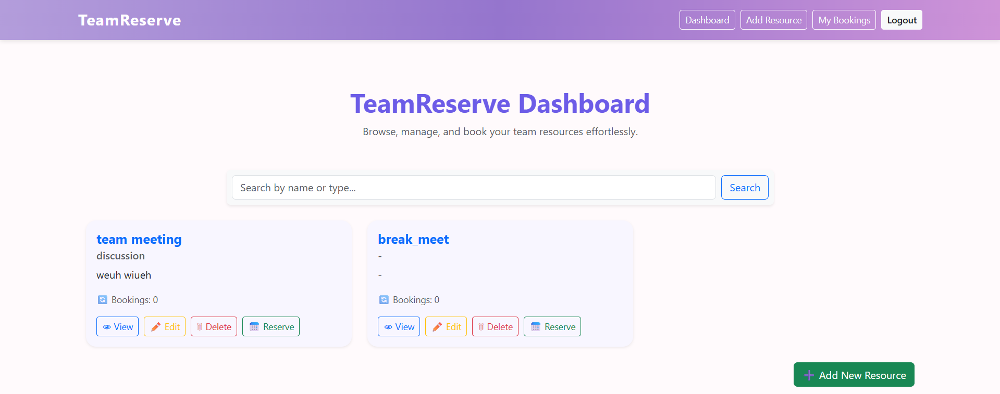
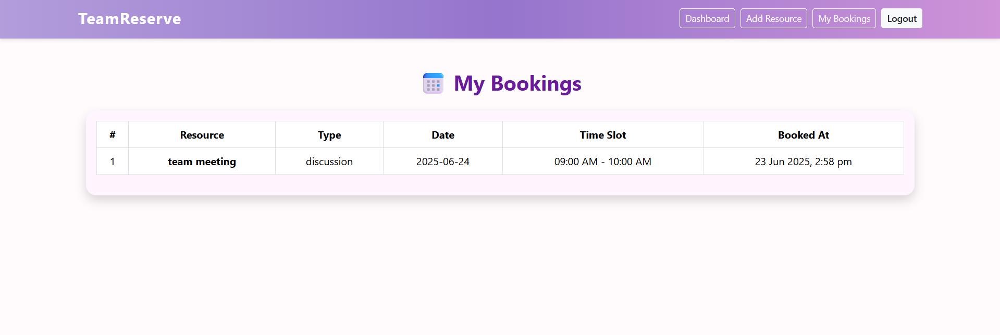
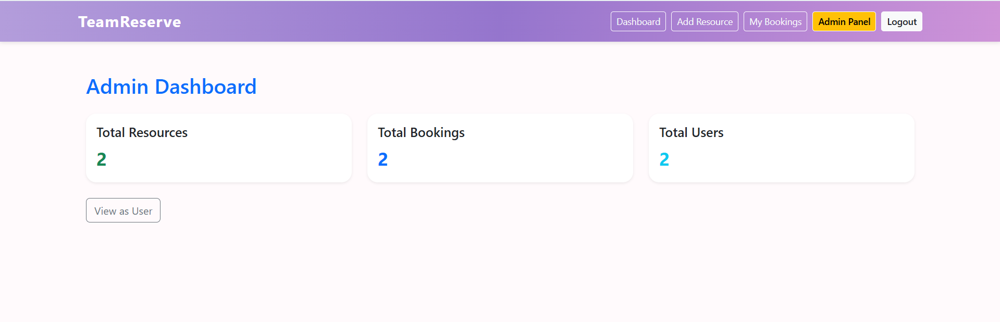

# 💼 TeamReserve

A **Resource Booking Web App** for remote teams, allowing users to reserve resources with date/time slots, manage bookings, and provide an admin dashboard for full control.

 <!-- You can replace or remove this line -->

---

## 🚀 Features

### 👤 User Features
- Sign up and log in securely
- Browse all available resources
- Search and filter by name or type
- Book time slots for any resource (with conflict prevention)
- View “My Bookings” dashboard

### 🛠️ Admin Features
- Admin sign-up & login
- View total counts: users, bookings, and resources
- Add/Edit/Delete resources
- View all bookings with user details
- Switch between user and admin views

---

## 🎨 Tech Stack

| Layer        | Tech |
|--------------|------|
| **Frontend** | HTML, CSS, Bootstrap 5, EJS |
| **Backend**  | Node.js, Express.js |
| **Database** | MongoDB Atlas |
| **Session & Auth** | Express-Session |
| **Deployment** | AWS EC2 |
| **Process Manager** | PM2 |
| **CI/CD** | GitHub Actions |
| **Reverse Proxy & SSL** | Nginx, Let's Encrypt |
| **Version Control** | Git & GitHub |

---

## 🖼️ Screenshots

| 📌 Dashboard | 🗓 Booking | 👩‍💻 Admin Panel |
|-------------|-----------|----------------|
|  |  |  |

---

## 🔧 Installation (Local Setup)

```bash
# 1. Clone the repository
git clone https://github.com/VasudhaShivane/teamReserve.git
cd teamReserve

# 2. Install dependencies
npm install

# 3. Set up environment variables
touch .env
